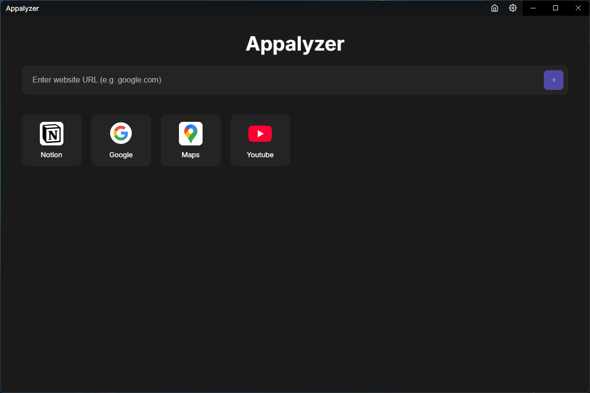
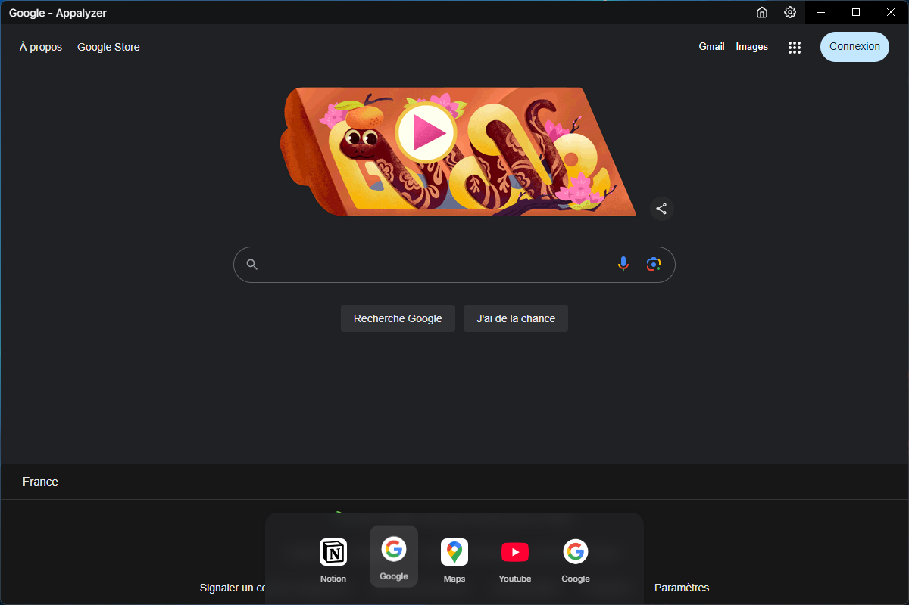

# Appalyzer

Appalyzer is a desktop application developed with **Electron** and **React**, designed to encapsulate web applications into standalone native windows. It provides a modern and intuitive user interface that allows users to seamlessly convert their favorite websites into independent desktop applications, complete with persistent sessions.





## Features

- **Native Web App Encapsulation**: Transform any website into a standalone desktop application.
- **Customizable Applications**: Assign custom icons and names to each encapsulated web application.
- **Persistent Sessions**: Manage browsing sessions, cookies, and permissions independently for each application.
- **Intelligent Session Handling**: Securely manage sessions for encapsulated applications.
- **Desktop Shortcuts**: Create shortcuts for quick access to applications.

## Installation (exe)

[Windows installer](https://github.com/achillebourgault/appalyzer/releases/download/release/Appalyzer.Setup.1.0.0.exe)

## Technology Stack

- **Electron**: For cross-platform desktop application development.
- **React**: For building dynamic and responsive user interfaces.
- **Node.js**: Backend integration and process handling.

## Installation

1. Clone the repository:
   ```bash
   git clone https://github.com/achillebourgault/appalyzer.git
   cd appalyzer
   ```

2. Install dependencies:
   ```bash
   npm install
   ```

3. Start the development environment:
   ```bash
   npm start
   ```

4. Build the application for production:
   ```bash
   npm run build
   npm run electron-pack
   ```

## License

This project is licensed under the [CC BY-NC 4.0 License](LICENSE).

## Contact

For questions or suggestions, please reach out at [achille.bourgault@gmail.com](mailto:achille.bourgault@gmail.com).

